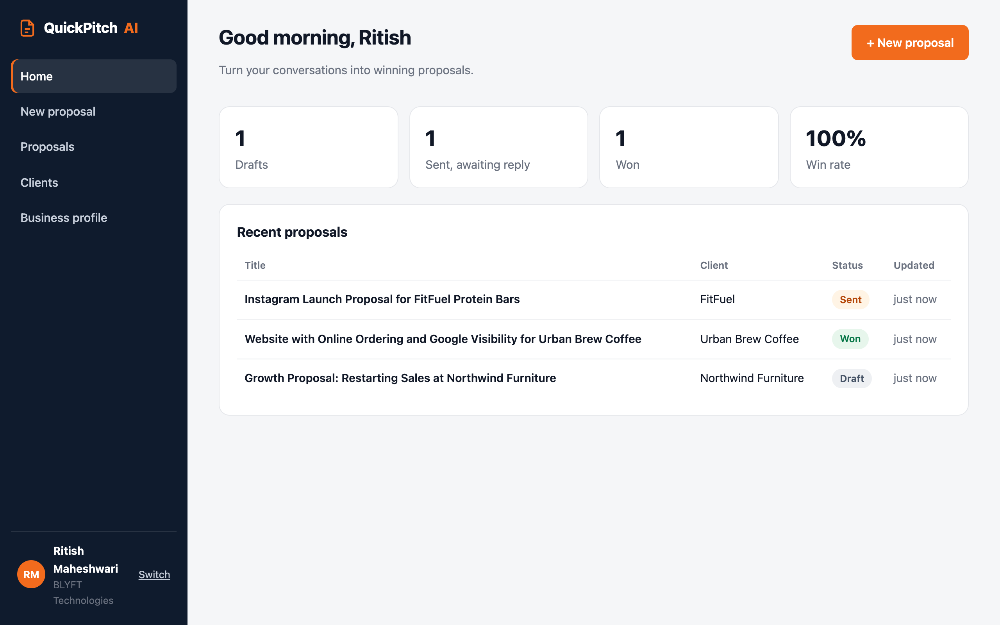
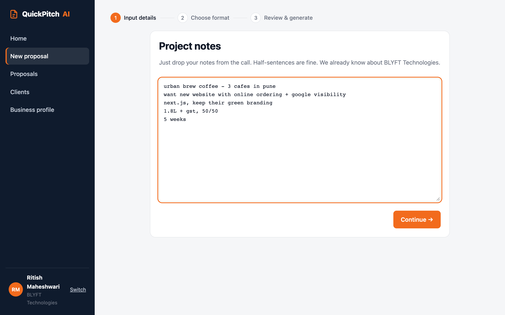
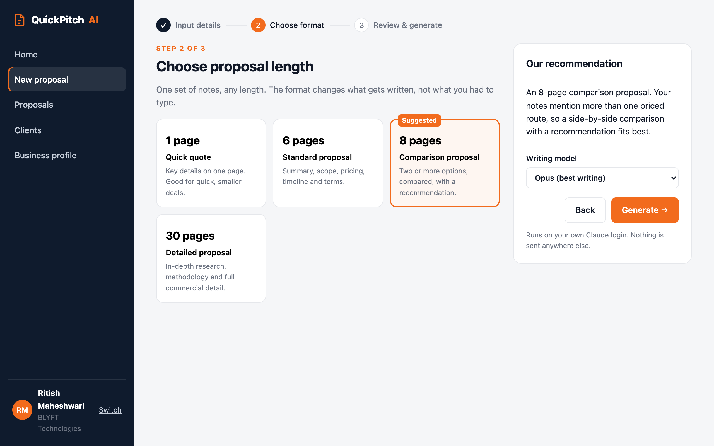
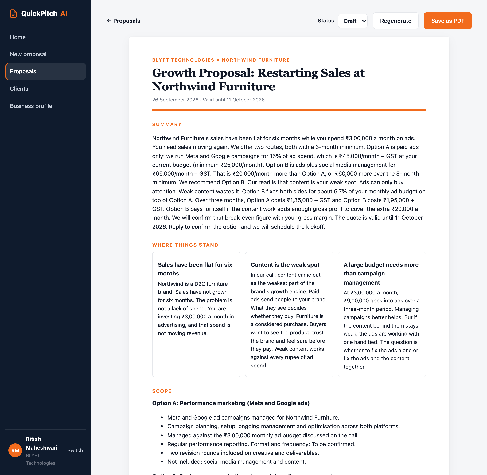

<div align="center">

# QuickPitch AI

### Sales conversation to client-ready proposal.

Turn client requirements, pricing and rough call notes into a clear, customised proposal in minutes.

**A product of [BLYFT Technologies](https://www.blyftit.com)**

[Live site](https://quickpitchai.vercel.app) · [Get started](#get-started) · [How it works](#how-it-works)

<br />



</div>

---

## The problem

**The proposal is the pitch, and it takes a day to write.**

A proposal that wins needs an executive summary the decision-maker can read alone, a scope written out section by section, options with a reasoned recommendation, the cost of ownership rather than just a price, and clear terms and next steps.

What actually gets sent after most sales calls is a WhatsApp message: *"Approx 3.25L for the custom one, will share details."* Then the proposal sits unwritten for days.

The founder already knows the pricing and the recommendation. **The work isn't the thinking. It's the assembly.** The information is scattered across calls, emails, notes, pricing sheets and old proposals, someone has to connect the dots, and every proposal comes out looking different.

## The idea

**QuickPitch AI writes the document. You keep the judgment.**

| | |
|---|---|
| **1. You type what you know** | Half-sentences straight after the call. No template to pick, no fields to fill in order. |
| **2. It decides the structure** | Two priced routes means a comparison, a recommendation and a break-even. The structure follows the deal. |
| **3. You send a finished PDF** | Branded, consistent, and as long as the deal deserves: one page or thirty. |

It already knows your business. Each account has a business profile: what you do, your services and standard pricing, who you work with, how you like to sound, and your standard terms. Every proposal is written as your company, not as a generic template.

## How it works

### 1. Drop your notes from the call



### 2. Choose how long it should be

One set of notes, any length. QuickPitch suggests a format based on the deal, and you can change it.

| Length | Best for |
|---|---|
| **1 page** · Quick quote | Smaller, time-sensitive deals |
| **6 pages** · Standard proposal | Summary, scope, pricing, timeline and terms |
| **8 pages** · Comparison proposal | Two or more options, compared, with a recommendation |
| **30 pages** · Detailed proposal | In-depth research, methodology and full commercial detail |



### 3. Get a client-ready proposal

Summary, current situation, scope, priced options, recommendation, timeline, payment and terms. Save it as a PDF and track it from Draft to Sent to Won.



## Why it's different

| | What it does | The writing |
|---|---|---|
| Proposal template tools (PandaDoc, Qwilr, Proposify) | Beautiful templates, e-sign | Still yours to write |
| Quote and invoice tools (Refrens, Zoho, Vyapar) | Line-item quotes and GST invoices | A form, not a document |
| **QuickPitch AI** | Writes the structure, the argument and the numbers from raw notes | **Done for you** |

A template assumes you already know what to write. Most founders don't have the time, which is why the proposal sits unwritten.

## Built for businesses that quote bespoke work every week

Where scope changes with every client and the proposal is written from scratch each time:

- Development agencies
- Design studios
- Marketing agencies
- Architecture and interiors
- Event and production companies
- Independent consultants
- System integrators and IT services
- Fabrication and custom manufacturing
- AMC and facility service providers

## Features

- **Personal dashboard** for every account: drafts, sent, won and win rate at a glance
- **Business profile** used in every proposal, so you never re-explain what you do
- **Never invents numbers.** Prices and terms come from your notes first, then your standard pricing, otherwise "To be confirmed"
- **Four lengths** from one set of notes, with a suggested format
- **Status tracking** from Draft to Sent to Won or Lost
- **Clients view** built from your proposal history
- **Regenerate** any proposal at a different length from the same notes
- **One-click PDF** in your brand colour

## Private by design, no API costs

QuickPitch runs on your own computer and writes proposals with **your own Claude plan** through [Claude Code](https://claude.com/claude-code).

- No API keys to set up
- No per-proposal cost
- Your client notes, pricing and proposals stay on your machine (`data/db.json`, never committed)

## Get started

**You need:** [Node.js](https://nodejs.org) 20+ and [Claude Code](https://claude.com/claude-code), logged in with your Claude account.

```bash
git clone https://github.com/Rmtech2006/QuickPitchAi.git
cd QuickPitchAi
npm install
npm run dev
```

Open **http://localhost:5173**, create your account, fill in your business profile, and write your first proposal.

> The [live site](https://quickpitchai.vercel.app) explains setup. Proposal writing happens on your own machine, so it can't generate proposals by itself.

## Roadmap

- [x] Notes to proposal, four lengths, PDF export
- [x] Accounts with business profiles
- [x] Dashboard, proposal history, status tracking, clients
- [ ] House styles: multiple branded layouts per company
- [ ] Logo upload and brand kit
- [ ] Templates and a reusable content library
- [ ] Hosted version with team accounts

## Tech

Vite, React and TypeScript, with zod schemas. Proposals are generated by running `claude -p` with a JSON schema, so every proposal comes back in a fixed, validated structure.

## About BLYFT Technologies

QuickPitch AI is built by **[BLYFT Technologies](https://www.blyftit.com)**, a growth consultancy with two engines: tech solutions (product, integrations and infrastructure) and marketing solutions (brand, content and performance).

We built QuickPitch because we write proposals for our own clients every week, and we wanted the proposal to go out the same day as the call.

**Questions or want QuickPitch for your team?** Visit [www.blyftit.com](https://www.blyftit.com).

<div align="center">
<br />
<sub>If you write proposals for a living, we'd like yours to be the next one we generate.</sub>
</div>
